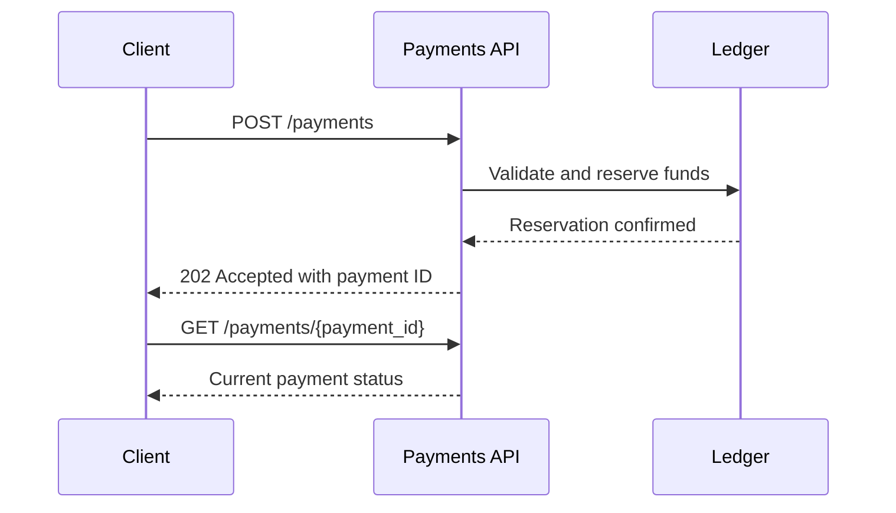

# Payment initiation flow

Use the Payments API to create a payment and retrieve its latest status. The caller supplies an idempotency key so retrying a timed-out request does not create a duplicate payment.

## Sequence



## Create a payment

Send `POST /payments` with an `Idempotency-Key` header and a JSON request containing the amount, currency and destination account.

```json
{
  "amount": "125.00",
  "currency": "USD",
  "destination_account": "example-account"
}
```

A successful request returns `202 Accepted`. Use the returned `payment_id` to retrieve status. A rejected request returns a problem-details response with a stable error type.
